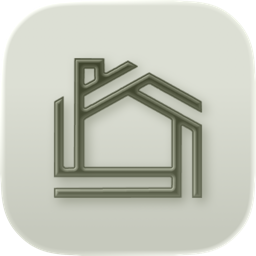

# Carlos Molero

**Product Designer and Engineer**

Product, design and UX, plus the code that ships it. 
Small tools, calm interfaces, software that does one thing properly.

Spain and South Korea (Gimcheon) &nbsp;·&nbsp; Available for freelance

[carlosmolero.com](https://carlosmolero.com) &nbsp;·&nbsp; [git.carlosmolero.com](https://git.carlosmolero.com)

---

## Projects

I self-host most of my repositories at **[git.carlosmolero.com](https://git.carlosmolero.com)**.
Only a handful get mirrored to GitHub, and only when there is real collaboration interest in them.

| Project                                                                                            | Description                                                                             |
| :------------------------------------------------------------------------------------------------- | :-------------------------------------------------------------------------------------- |
| **[marceline](https://git.carlosmolero.com/marceline/)**                                           | Mastodon bot that turns YouTube links into tagged songs in Navidrome.                   |
| **[penpot-sequential-pdf-exporter](https://git.carlosmolero.com/penpot-sequential-pdf-exporter/)** | Penpot plugin that exports the selected boards, in order, as the pages of a single PDF. |

### Contributions

Because the work lives on my own server, the graph below is built from my self-hosted
repositories rather than from GitHub activity.

<!--
  TODO: rendered by .github/workflows/contributions.yml once the generator exists.
  Uncomment when the workflow is in place.

  

    <picture>
      <source media="(prefers-color-scheme: dark)" srcset="./assets/contributions-dark.svg">
      
    </picture>
  

-->

---

## Currently

<table>
<tr>
<td align="center" width="140">

</td>
<td width="440">
<strong>Head of Product, Design and UX</strong> 
<a href="https://pataluha.com">Pataluha</a>, building <a href="https://solidmaint.com">SolidMaint</a>
  
Nordic-standard property maintenance on the Costa del Sol. 
Every visit verified, photo-documented and fully receipted.
</td>
</tr>
</table>

